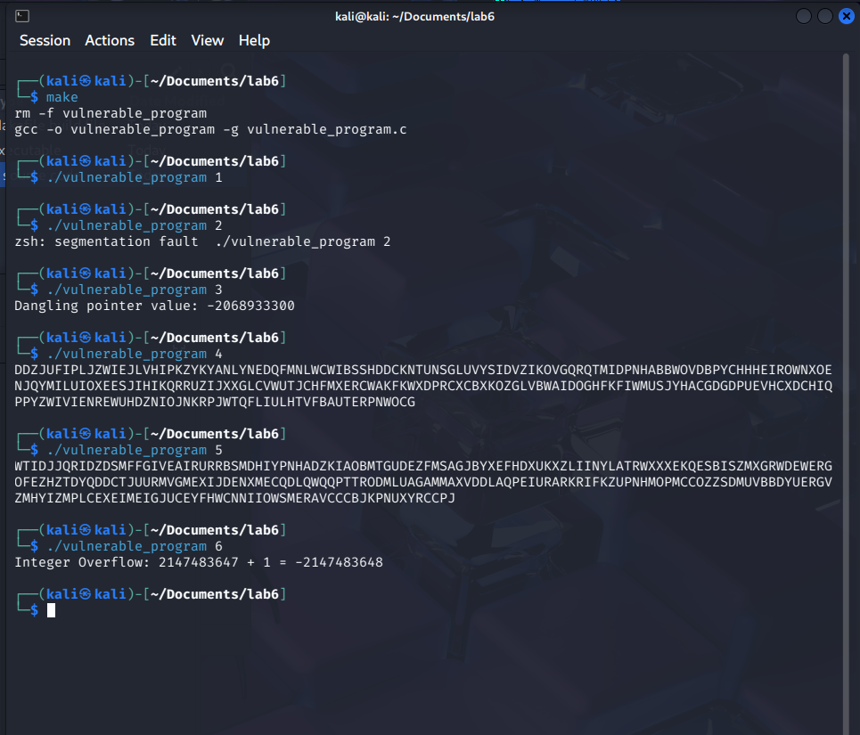
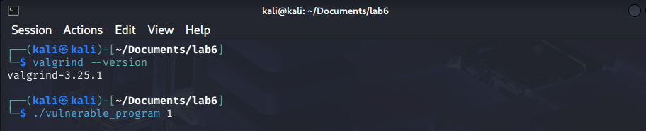
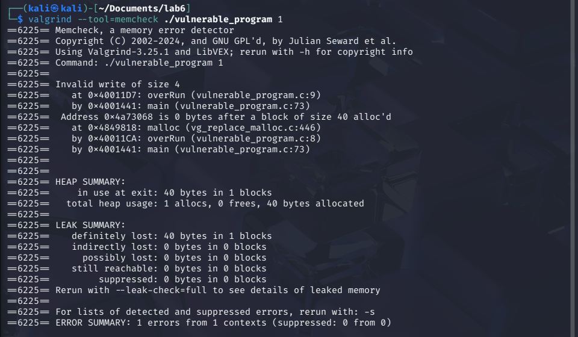
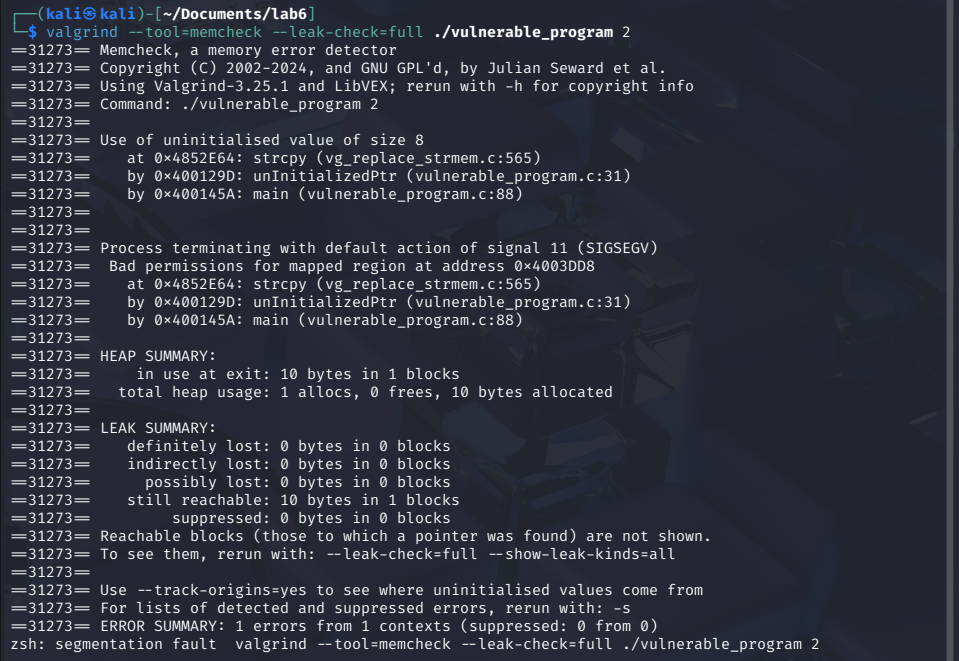

# **Lab 6 Report**  
##### CSCY/CSCI 4742: Cybersecurity Programming and Analytics, Spring 2026

**Name & Student ID**: [Your Full Name], [Your Student ID]  

---

## **Task 1: Implement & Analyze Additional Vulnerabilities**  

1. **Commented Source Code**  
```c
#include <stdlib.h>
#include <stdio.h>
#include <string.h>
#include <time.h>
#include <limits.h>  // Required for integer limits

void randStringGen(int x, char* c) {
    srand(time(NULL));
    for (int i = 0; i < x - 1; ++i) {
        *c = 'A' + (rand() % 26);
        c++;
    }
    *c = '\0';
}

// argv[1] = 1
void overRun(void) {
    int *x = malloc(10 * sizeof(int));
    // We have created a buffer of dynamic memory of size 10, but we will write beyond it at index 10, which is out of bounds because index 10 is the 11th element (0-9 are valid indices)
    x[10] = 0;  // Buffer overrun
    // There should be a call to `free(x)` here to avoid a memory leak, but it is not included in this function.  This is an example of a memory leak vulnerability because the allocated memory is not freed after it is no longer needed.
}

// argv[1] = 2
void unInitializedPtr(void) {
    char *buffer;
    char *c = malloc(10 * sizeof(char));
    randStringGen(10, c);
    // `buffer` is a pointer, but it has not been initialized with a value or allocate to dynamic memory.  When we call `strcpy()`, it is attempting to copy the string to an undefined location in memory
    strcpy(buffer, c);  // Using an uninitialized pointer
    printf("%s\n", buffer);
    free(c);
    free(buffer);
}

// argv[1] = 3
void danglingPtr(void) {
    int *x;
    int *y = malloc(10 * sizeof(int));
    x = y;
    free(y);  // x is now a dangling pointer
    // `y` was allocated dynamic memory, and then `x` was assigned to the same address. After `free(y)`, the memory is deallocated, but `x` still points to that memory location, which is now invalid. So accessing `x[2]` is trying to read from a memory location that has been freed
    int t = x[2];  // Accessing freed memory
    printf("Dangling pointer value: %d\n", t);
}

// argv[1] = 4
void bufferUnder(void) {
    char buffer[256];
    char *c = malloc(255 * sizeof(char));
    randStringGen(255, c);
    // `buffer` is an array of 256 characters (with the final character being the null terminator), but `c` is only allocated 255 characters. When we call `strcpy()` we are attempting to to copy 255 characters into dynamic memory that is allocated for 256 characters, which has one extra character.  The final character is pointing to undefined memory, which is a buffer underflow vulnerability if `buffer[255]` is used later in the program.  It might not be that much of a problem since it currently holds a null-terminated string and most string functions will stop at the null terminater, but it could be a problem in other cases.
    strcpy(buffer, c);  // Possible buffer underflow
    printf("%s\n", buffer);
    free(c);
}

// argv[1] = 5
void bufferOver(void) {
    char buffer[256];
    char *c = malloc(260 * sizeof(char));
    randStringGen(260, c);
    // `buffer` is an array of 256 characters, and `c` is allocated to 260 characters of dynamic memory.  When we copy `c` into `buffer`, we are writing 4 characters past the end of `buffer`'s stack memory.  This is a buffer overflow that overwrites whatever is in the next memory position.
    strcpy(buffer, c);  // Buffer overflow
    printf("%s\n", buffer);
    free(c);
}

// argv[1] = 6
void integerOverflow(void) {
    int a = INT_MAX;  // Max signed int value
    int b = 1;
    // We set `a` to the maxium value for a signed integer, and then we add 1 to it.  This causes an integer overflow because the result exceeds the maximum representable value for an `int`. This should cause the value to wrap around to the lowest negative value for a signed `int`, which is not what the coder intended.
    int result = a + b;  // Causes overflow
    printf("Integer Overflow: %d + %d = %d\n", a, b, result);
}

int main(int argc, char**argv) {
    if (argc != 2) {
        return 0;
    }
    int x = atoi(argv[1]);  // Convert input to integer

    if (x == 1) {
        overRun();
    } else if (x == 2) {
        unInitializedPtr();
    } else if (x == 3) {
        danglingPtr();
    } else if (x == 4) {
        bufferUnder();
    } else if (x == 5) {
        bufferOver();
    } else if (x == 6) {
        integerOverflow();
    }

    return 0;
}

```

2. **Program Outputs**  
   - 

---

## **Task 2: Out-of-Bounds Write (Valgrind)**
### **Screenshots**  
1. *(Screenshot of running `./vulnerable_program 1` without Valgrind.)*
   

2. *(Screenshot of Valgrind output: `valgrind --tool=memcheck ./vulnerable_program 1`.)*  
   

3. *(Screenshot of Valgrind with `--leak-check=full`.)*
   

5. *(Screenshot after fixing the `overRun` function to confirm no more errors.)*
   

### **Answers to Questions**  
- **1.** Why does this invalid write error happen?  
  *We have created an array of `int`s that is 10 `int`s long.  When we do `x[10] = 0`, we are writing past the end of the array because the index begins at `0`, making the 10th position actually at index `9`.  Therefor index `10` is out of bounds.*

- **2.** Why does Valgrind report an "invalid write of size 4"? What does `4` represent?  
  *In C, the `int` datatype is 4 bytes long.  Since memory is addressed by bytes, this is equal to a size of 4 address places.*

- **3.** What is an off-by-one error? Do you see this error in the `overRun` function?  
  *An "off by one" error is when the coder makes a mistake in an array index or a loop where they have accidentally accessed or written to the array position that is one position past or before the end.  This is usually caused by the array index starting at `0`.  So the last index of array of length 10 is actually index `9`.*

- **4.** What is a memory leak? Explain in your own words. Do you see a memory leak in the `overRun` function?
  *A memory leak is when a program dynamically allocates a piece of memory and then fails to de-allocate all or part of it when it is finished.  Writing to index `10` is not a memory leak, but this function also fails to call `free(x)`*

- **5.** Can errors like this occur in Java? Why or why not?  
  *Java can not perform errors of either kind without at least a runtime exception.  This is because the JRE has built-in bounds checking and also has garbage collection to de-allocate dynamic memory once the pointer is no longer used.*

- **6.** Compare the Heap Summary from normal Valgrind output vs. `--leak-check=full`. What additional details are shown?  
  *It provides additional debugging information from the `-g` flag when we compiled with `gcc`.  It can see that the memory is never de-allocated at the end of `main()` and has traced the leak to it's position in the code where it was first allocated:*
```
==20292== 40 bytes in 1 blocks are definitely lost in loss record 1 of 1
==20292==    at 0x4849818: malloc (vg_replace_malloc.c:446)
==20292==    by 0x40011CA: overRun (vulnerable_program.c:8)
==20292==    by 0x4001441: main (vulnerable_program.c:73)
```

### **Updated Code for `overRun` Function**  
```c
void overRun(void) {
    int *x = malloc(10 * sizeof(int));
    // Below I have changed `x[10]` to `x[9]` to avoid an out-of-bounds access.
    x[9] = 0;
    // Below I have added `free(x)` to properly deallocate the memory that was allocated for `x`.
    free(x);
}
```

---

## **Task 3: Uninitialized Pointer Analysis**  
### **Screenshots**  
1. *(Screenshot of `valgrind --tool=memcheck --leak-check=full ./vulnerable_program 2`.)*
   

2. *(Screenshot with `--track-origins=yes` for more detail.)*
   

3. *(Screenshot of fixed function showing no more uninitialized pointer usage issues.)*  

### **Answers to Questions**  
- **7.** Where is the memory problem occurring? What does Valgrind report?  
  *(Answer here)*  
- **8.** What is an uninitialized pointer? How could it be exploited?  
  *(Answer here)*  
- **9.** What is the difference between a `NULL` pointer and an uninitialized pointer?  
  *(Answer here)*  
- **10.** What specifically in the code do you believe caused the uninitialized pointer usage?  
  *(Answer here)*  
- **11.** What additional detail does `--track-origins=yes` provide?  
  *(Answer here)*  
- **12.** "Use of uninitialized value of size 8" — what does the `8` refer to?  
  *(Answer here)*  

### **Updated Code for `unInitializedPtr` Function**  
```c
/* Insert your corrected unInitializedPtr function here. 
   Include inline comments explaining the fix. */
```

---

## **Task 4: Dangling Pointer Analysis**  
### **Screenshots**  
1. *(Screenshot of `./vulnerable_program 3` without Valgrind — note behavior.)*  
2. *(Screenshot of Valgrind output: `valgrind --tool=memcheck --leak-check=full --track-origins=yes ./vulnerable_program 3`.)*  
3. *(Screenshot after fixing `danglingPtr`, showing no error.)*  

### **Answers to Questions**  
- **13.** What is the potential issue in the `danglingPtr` function?  
  *(Answer here)*  
- **14.** How could a dangling pointer be exploited?  
  *(Answer here)*  
- **15.** What does Valgrind report about the freed memory usage?  
  *(Answer here)*  
- **16.** Why does Valgrind possibly show no final "heap error" even though it’s a dangerous bug?  
  *(Answer here)*  

### **Updated Code for `danglingPtr` Function**  
```c
/* Insert your corrected danglingPtr function here. 
   Include inline comments explaining the fix. */
```

---

## **Task 5: Buffer Overflows Analysis**  
### **Screenshots**  
- **For `bufferUnder` (Input 4):**  
  1. *(Screenshot of Valgrind output with `./vulnerable_program 4`.)*  
- **For `bufferOver` (Input 5):**  
  2. *(Screenshot of Valgrind output with `./vulnerable_program 5` — if any overflow detected.)*  
  3. *(Screenshot of AddressSanitizer detection using `./vulnerable_program2 5`.)*  
  4. *(Screenshot after fixing `bufferOver`, no errors remain.)*  

### **Answers to Questions**  
- **(Regarding `bufferUnder`, Input 4)**  
  - **15.** Do you see errors in the Valgrind output?  
    *(Answer here)*  
  - **16.** After reading the code, do you expect errors? Why/why not?  
    *(Answer here)*  

- **(Regarding `bufferOver`, Input 5)**  
  - **17.** Do you expect an error here? Why?  
    *(Answer here)*  
  - **18.** Does Valgrind detect it? If so, what is reported?  
    *(Answer here)*  
  - **19.** Why does Valgrind sometimes struggle to detect this kind of buffer overflow?  
    *(Answer here)*  

- **(Valgrind vs. Other Tools)**  
  - **20.** List two additional Valgrind tools besides `memcheck`.  
    *(Answer here)*  
  - **21.** How could these other tools detect errors that `memcheck` misses?  
    *(Answer here)*  

### **AddressSanitizer Findings**  
- **22.** What errors does AddressSanitizer report for input `5`?  
  *(Answer here)*  
- **23.** Where in the code does it say the error occurs?  
  *(Answer here)*  
- **24.** How does AddressSanitizer compare to Valgrind in detecting buffer overflows?  
  *(Answer here)*  

### **Updated Code for `bufferOver` Function**  
```c
/* Insert your corrected bufferOver function here. 
   Include inline comments explaining the fix. */
```

---

## **Task 6: Integer Overflow Analysis**  
### **Screenshots**  
1. *(Screenshot of `./vulnerable_program 6` showing normal run — note any incorrect result.)*  
2. *(Screenshot of `valgrind --tool=memcheck ... ./vulnerable_program 6` showing whether it detects overflow.)*  
3. *(Screenshot of UBSan detection: `./vulnerable_program2 6`.)*  
4. *(Screenshot of fixed function, showing no more overflow vulnerability.)*  

### **Answers to Questions**  
- **25.** Why does the overflow occur at `UINT_MAX + 1`?  
  *(Answer here)*  
- **26.** What are common security risks of integer overflows, and how might attackers exploit them?  
  *(Answer here)* 
 - **27.** Does Valgrind report the integer overflow? If not, why?  
 *(Answer here)* 
- **28.** Does UBSan report an error?  
  *(Answer here)*  
- **29.** Where in the code does UBSan say the overflow occurs?  
  *(Answer here)*  
- **30.** Compare UBSan’s detection to Valgrind’s.  
  *(Answer here)*  

### **Updated Code for `integerOverflow` Function**  
```c
/* Insert your corrected integerOverflow function here. 
   Include inline comments explaining the fix. */
```

---

## **Task 7: Static Analysis with Flawfinder**  
### **Screenshots**  
1. *(Screenshot of `flawfinder vulnerable_program.c` output.)*  

### **Answers to Questions**  
- **31.** Differentiate static vs. dynamic analysis of source code.  
  *(Answer here)*  
- **32.** How do static analysis tools like Flawfinder differ from dynamic tools (Valgrind, AddressSanitizer)?  
  *(Answer here)*  

### **Flawfinder Vulnerabilities**  
- **33.** `strcpy` issues  
  - Location, risk level, CWE classification, and prevention.  
  *(Answers here)*  
- **34.** `srand` usage (weak randomness)  
  - Why is it a concern, relevant CWE, safer alternatives.  
  *(Answers here)*  
- **35.** Statically-sized arrays  
  - Where used, security risks, relevant CWE, safer approaches.  
  *(Answers here)*  

*(Paste or summarize key parts of the Flawfinder output. Explain any false positives or unaddressed concerns.)*

---


# **Lab 6: Summary & Reflections**  

### **Key Takeaways from Lab 6**  
*(Summarize your main findings, what you learned, and any challenges faced during the lab.)*  
