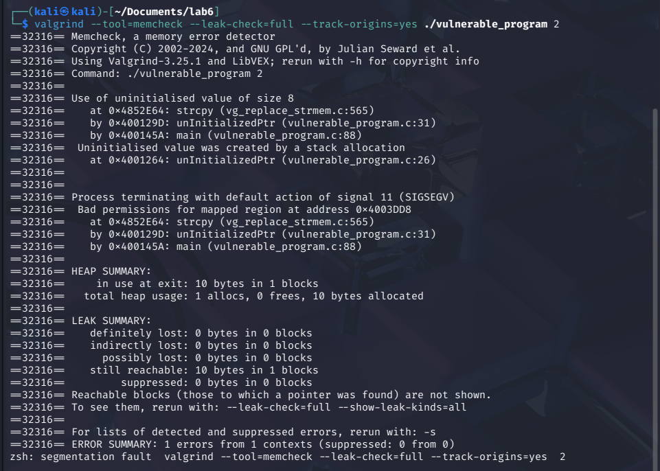
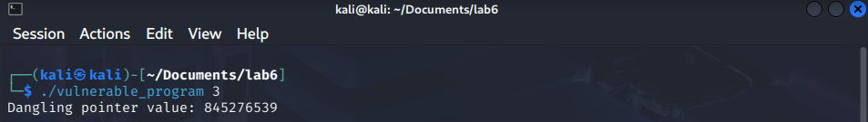
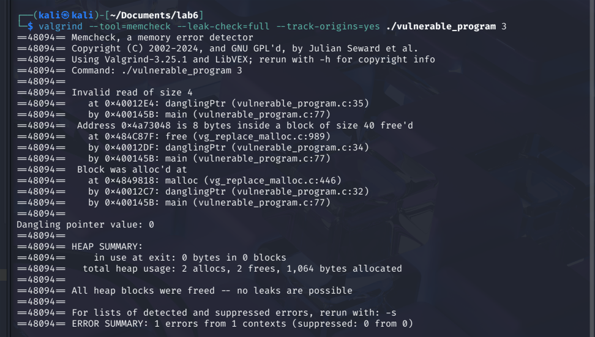
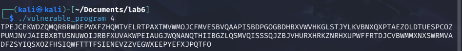
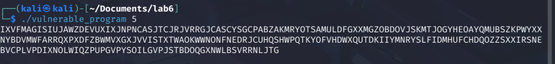
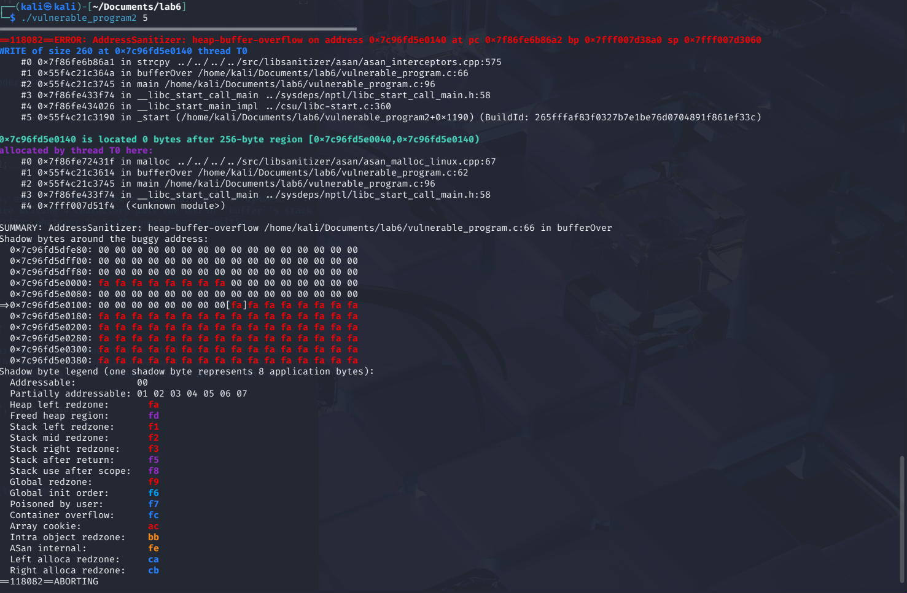
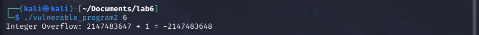
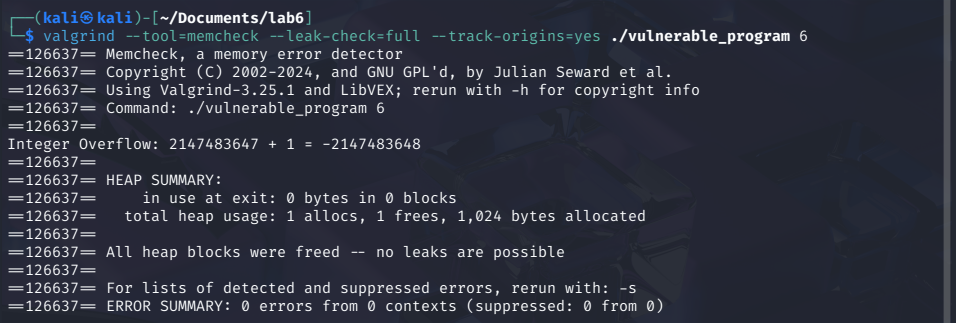
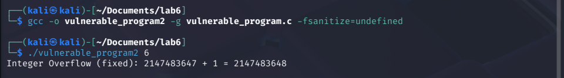

# **Lab 6 Report**  
##### CSCY/CSCI 4742: Cybersecurity Programming and Analytics, Spring 2026

**Name & Student ID**: [Your Full Name], [Your Student ID]  

---

## **Task 1: Implement & Analyze Additional Vulnerabilities**  

1. **Commented Source Code**  
```c
#include <stdlib.h>
#include <stdio.h>
#include <string.h>
#include <time.h>
#include <limits.h>  // Required for integer limits

void randStringGen(int x, char* c) {
    srand(time(NULL));
    for (int i = 0; i < x - 1; ++i) {
        *c = 'A' + (rand() % 26);
        c++;
    }
    *c = '\0';
}

// argv[1] = 1
void overRun(void) {
    int *x = malloc(10 * sizeof(int));
    // We have created a buffer of dynamic memory of size 10, but we will write beyond it at index 10, which is out of bounds because index 10 is the 11th element (0-9 are valid indices)
    x[10] = 0;  // Buffer overrun
    // There should be a call to `free(x)` here to avoid a memory leak, but it is not included in this function.  This is an example of a memory leak vulnerability because the allocated memory is not freed after it is no longer needed.
}

// argv[1] = 2
void unInitializedPtr(void) {
    char *buffer;
    char *c = malloc(10 * sizeof(char));
    randStringGen(10, c);
    // `buffer` is a pointer, but it has not been initialized with a value or allocate to dynamic memory.  When we call `strcpy()`, it is attempting to copy the string to an undefined location in memory
    strcpy(buffer, c);  // Using an uninitialized pointer
    printf("%s\n", buffer);
    free(c);
    free(buffer);
}

// argv[1] = 3
void danglingPtr(void) {
    int *x;
    int *y = malloc(10 * sizeof(int));
    x = y;
    free(y);  // x is now a dangling pointer
    // `y` was allocated dynamic memory, and then `x` was assigned to the same address. After `free(y)`, the memory is deallocated, but `x` still points to that memory location, which is now invalid. So accessing `x[2]` is trying to read from a memory location that has been freed
    int t = x[2];  // Accessing freed memory
    printf("Dangling pointer value: %d\n", t);
}

// argv[1] = 4
void bufferUnder(void) {
    char buffer[256];
    char *c = malloc(255 * sizeof(char));
    randStringGen(255, c);
    // `buffer` is an array of 256 characters (with the final character being the null terminator), but `c` is only allocated 255 characters. When we call `strcpy()` we are attempting to to copy 255 characters into dynamic memory that is allocated for 256 characters, which has one extra character.  The final character is pointing to undefined memory, which is a buffer underflow vulnerability if `buffer[255]` is used later in the program.  It might not be that much of a problem since it currently holds a null-terminated string and most string functions will stop at the null terminater, but it could be a problem in other cases.
    strcpy(buffer, c);  // Possible buffer underflow
    printf("%s\n", buffer);
    free(c);
}

// argv[1] = 5
void bufferOver(void) {
    char buffer[256];
    char *c = malloc(260 * sizeof(char));
    randStringGen(260, c);
    // `buffer` is an array of 256 characters, and `c` is allocated to 260 characters of dynamic memory.  When we copy `c` into `buffer`, we are writing 4 characters past the end of `buffer`'s stack memory.  This is a buffer overflow that overwrites whatever is in the next memory position.
    strcpy(buffer, c);  // Buffer overflow
    printf("%s\n", buffer);
    free(c);
}

// argv[1] = 6
void integerOverflow(void) {
    int a = INT_MAX;  // Max signed int value
    int b = 1;
    // We set `a` to the maxium value for a signed integer, and then we add 1 to it.  This causes an integer overflow because the result exceeds the maximum representable value for an `int`. This should cause the value to wrap around to the lowest negative value for a signed `int`, which is not what the coder intended.
    int result = a + b;  // Causes overflow
    printf("Integer Overflow: %d + %d = %d\n", a, b, result);
}

int main(int argc, char**argv) {
    if (argc != 2) {
        return 0;
    }
    int x = atoi(argv[1]);  // Convert input to integer

    if (x == 1) {
        overRun();
    } else if (x == 2) {
        unInitializedPtr();
    } else if (x == 3) {
        danglingPtr();
    } else if (x == 4) {
        bufferUnder();
    } else if (x == 5) {
        bufferOver();
    } else if (x == 6) {
        integerOverflow();
    }

    return 0;
}

```

2. **Program Outputs**  
   - 

---

## **Task 2: Out-of-Bounds Write (Valgrind)**
### **Screenshots**  
1. *(Screenshot of running `./vulnerable_program 1` without Valgrind.)*
   

2. *(Screenshot of Valgrind output: `valgrind --tool=memcheck ./vulnerable_program 1`.)*  
   

3. *(Screenshot of Valgrind with `--leak-check=full`.)*
   

5. *(Screenshot after fixing the `overRun` function to confirm no more errors.)*
   

### **Answers to Questions**  
- **1.** Why does this invalid write error happen?  
  *We have created an array of `int`s that is 10 `int`s long.  When we do `x[10] = 0`, we are writing past the end of the array because the index begins at `0`, making the 10th position actually at index `9`.  Therefor index `10` is out of bounds.*

- **2.** Why does Valgrind report an "invalid write of size 4"? What does `4` represent?  
  *In C, the `int` datatype is 4 bytes long.  Since memory is addressed by bytes, this is equal to a size of 4 address places.*

- **3.** What is an off-by-one error? Do you see this error in the `overRun` function?  
  *An "off by one" error is when the coder makes a mistake in an array index or a loop where they have accidentally accessed or written to the array position that is one position past or before the end.  This is usually caused by the array index starting at `0`.  So the last index of array of length 10 is actually index `9`.*

- **4.** What is a memory leak? Explain in your own words. Do you see a memory leak in the `overRun` function?
  *A memory leak is when a program dynamically allocates a piece of memory and then fails to de-allocate all or part of it when it is finished.  Writing to index `10` is not a memory leak, but this function also fails to call `free(x)`*

- **5.** Can errors like this occur in Java? Why or why not?  
  *Java can not perform errors of either kind without at least a runtime exception.  This is because the JRE has built-in bounds checking and also has garbage collection to de-allocate dynamic memory once the pointer is no longer used.*

- **6.** Compare the Heap Summary from normal Valgrind output vs. `--leak-check=full`. What additional details are shown?  
  *It provides additional debugging information from the `-g` flag when we compiled with `gcc`.  It can see that the memory is never de-allocated at the end of `main()` and has traced the leak to it's position in the code where it was first allocated:*
```
==20292== 40 bytes in 1 blocks are definitely lost in loss record 1 of 1
==20292==    at 0x4849818: malloc (vg_replace_malloc.c:446)
==20292==    by 0x40011CA: overRun (vulnerable_program.c:8)
==20292==    by 0x4001441: main (vulnerable_program.c:73)
```

### **Updated Code for `overRun` Function**  
```c
void overRun(void) {
    int *x = malloc(10 * sizeof(int));
    // Below I have changed `x[10]` to `x[9]` to avoid an out-of-bounds access.
    x[9] = 0;
    // Below I have added `free(x)` to properly deallocate the memory that was allocated for `x`.
    free(x);
}
```

---

## **Task 3: Uninitialized Pointer Analysis**  
### **Screenshots**  
1. *(Screenshot of `valgrind --tool=memcheck --leak-check=full ./vulnerable_program 2`.)*
   

2. *(Screenshot with `--track-origins=yes` for more detail.)*
   

3. *(Screenshot of fixed function showing no more uninitialized pointer usage issues.)*
   

### **Answers to Questions**  
- **7.** Where is the memory problem occurring? What does Valgrind report?
  *It can be traced with the following debug information.  The error occurs at `strcpy (vg_replace_strmem.c:565)` which can be traced upwards through subsequent stack frames first at `unInitializedPtr (vulnerable_program.c:43)` and second at `main (vulnerable_program.c:75)`*
```
==35835== Use of uninitialised value of size 8
==35835==    at 0x4852E64: strcpy (vg_replace_strmem.c:565)
==35835==    by 0x400133F: unInitializedPtr (vulnerable_program.c:43)
==35835==    by 0x400144E: main (vulnerable_program.c:75)
```

- **8.** What is an uninitialized pointer? How could it be exploited?
  *An unitialized pointer happens when a coder declares a pointer but never defines it.  It can be exploited because it is going to access an unknown position in the heap.*

- **9.** What is the difference between a `NULL` pointer and an uninitialized pointer?  
  *A `NULL` pointer is actually an initialized pointer, but it is defined to point at nothing (null). This is different than an unitialized pointer which is never defined to point at anything.  This could point to anything, whatever value happens to be at that pointer's variable in the heap.  In my experience, uninitialized heap memory has always been filled with `0x0`, making the pointer technically a null pointer because in C, `NULL` is a constant equal to `0`.  But officially it is undefined behavior and could be point towards anything.*

- **10.** What specifically in the code do you believe caused the uninitialized pointer usage?  
  *The line that reads `char *buffer;` is the problem because it is declared but never defined.*

- **11.** What additional detail does `--track-origins=yes` provide?  
  *It adds the following lines to the output:*
```
==42662==  Uninitialised value was created by a stack allocation
==42662==    at 0x4001306: unInitializedPtr (vulnerable_program.c:39)
```

- **12.** "Use of uninitialized value of size 8" — what does the `8` refer to?  
  *Since we are running a 64 bit operating system, all memory addresses are 64 bits long, which is 8 bytes.*

### **Updated Code for `unInitializedPtr` Function**  
```c
void unInitializedPtr(void) {
    // Below I have allocated memory for `buffer` and `c` to avoid using and uninitialized pointer.
    char *buffer = malloc(10 * sizeof(char));
    char *c = malloc(10 * sizeof(char));
    randStringGen(10, c);
    strcpy(buffer, c);
    printf("%s\n", buffer);
    free(c);
    free(buffer);
}
```

---

## **Task 4: Dangling Pointer Analysis**  
### **Screenshots**  
1. *(Screenshot of `./vulnerable_program 3` without Valgrind — note behavior.)*
   

2. *(Screenshot of Valgrind output: `valgrind --tool=memcheck --leak-check=full --track-origins=yes ./vulnerable_program 3`.)*  
   

3. *(Screenshot after fixing `danglingPtr`, showing no error.)*
   
### **Answers to Questions**  
- **13.** What is the potential issue in the `danglingPtr` function?  
  *Two pointers are defined, `x` and `y`.  `y` is allocated to dynamic memory and then the address is also copied into `x`.  `y` is freed, making the memory it pointed to no longer valid.  Now `x` holds an address to invalid memory.  Then `x` is accessed, which is accessing the invalid memory location.*  

- **14.** How could a dangling pointer be exploited?  
  *If the memory is freed and then, at a later point in execution, dynamic memory is allocated later then the dangling pointer can read or write to this area of memory that is now being used by another function.  The dangling pointer can then be used to change the behavior of this other function.*

- **15.** What does Valgrind report about the freed memory usage?  
  *It says `Invalid read of size 4` which is referring to where it tries to read an `int` from memory that was freed.  It says the read occurrs at `vulnerable_program.c:35`.  It also says the value of the offending address is `0x4a73048`, and where `free()` was called in the code (`vulnerable_program.c:34`)*.  It also gives the location in the code where that block of dynamic memory was allocated: `vulnerable_program.c:32`.  That information is given in the stack trace.
```
==48094== Invalid read of size 4
==48094==    at 0x40012E4: danglingPtr (vulnerable_program.c:35)
==48094==    by 0x400145B: main (vulnerable_program.c:77)
==48094==  Address 0x4a73048 is 8 bytes inside a block of size 40 free'd
==48094==    at 0x484C87F: free (vg_replace_malloc.c:989)
==48094==    by 0x40012DF: danglingPtr (vulnerable_program.c:34)
==48094==    by 0x400145B: main (vulnerable_program.c:77)
==48094==  Block was alloc'd at
==48094==    at 0x4849818: malloc (vg_replace_malloc.c:446)
==48094==    by 0x40012C7: danglingPtr (vulnerable_program.c:32)
==48094==    by 0x400145B: main (vulnerable_program.c:77)
```

- **16.** Why does Valgrind possibly show no final "heap error" even though it’s a dangerous bug?  
  *I am not exactly sure why, but my guess is that it doesn't show a "heap error" because it that block of memory has not yet be re-allocated.  So even though it has been freed, the memory pointed to by that address is not being used yet so it likely won't affect the behavior of any other functions.  I also noticed that the output of `vulnerable_program` itself is different.  It's `0` instead of `845276593`.  I am not sure why that is happening, maybe something to do with the way valgrind monitors the memory.*

### **Updated Code for `danglingPtr` Function**  
```c
void danglingPtr(void) {
    int *x;
    int *y = malloc(10 * sizeof(int));
    x = y;
    // Below, I initialize the dynamic memory to all 0's to avoid valgrind reporting an 'Uninitialized value` error
    memset(y, 0, 10 * sizeof(int));
    int t = x[2];
    printf("Dangling pointer value: %d\n", t);
    // Below is where I moved the call to `free()`, which is after the last point in the code where it is used.
    free(y);
}
```

---

## **Task 5: Buffer Overflows Analysis**  
### **Screenshots**  
- **For `bufferUnder` (Input 4):**  
  1. *(Screenshot of Valgrind output with `./vulnerable_program 4`.)*
     

- **For `bufferOver` (Input 5):**  
  1. *(Screenshot of Valgrind output with `./vulnerable_program 5` — if any overflow detected.)*
     

  3. *(Screenshot of AddressSanitizer detection using `./vulnerable_program 5`.)*
     

  4. *(Screenshot after fixing `bufferOver`, no errors remain.)*
     

### **Output from Valgrind**  
- **Input 4**
```
==106834== Memcheck, a memory error detector
==106834== Copyright (C) 2002-2024, and GNU GPL'd, by Julian Seward et al.
==106834== Using Valgrind-3.25.1 and LibVEX; rerun with -h for copyright info
==106834== Command: ./vulnerable_program 4
==106834== 
GZPCBKTWIALFDHKNOHQJJTGPPWHZEKMMMDONOHLYJWDNFPAVWSEFNNXEJEFPQRCCVSRJADHLBMAHBCEZWLGJYDPJHUZAMBCHTUSVZBJANJJQOOPKZVWXZLGIGHIUINDEHVBGYMINYSDMGUWHPUGQGMBOULKEYNKHKMPIYYVWSYKASJHJDNCLBFBXSLCTYOAIASQBSNZKLKMFVVRYIVMLANJSZNLZBOIEGAHAOIMBUYHPTAQDVCOXPZROODQQTY
==106834== 
==106834== HEAP SUMMARY:
==106834==     in use at exit: 0 bytes in 0 blocks
==106834==   total heap usage: 2 allocs, 2 frees, 1,279 bytes allocated
==106834== 
==106834== All heap blocks were freed -- no leaks are possible
==106834== 
==106834== For lists of detected and suppressed errors, rerun with: -s
==106834== ERROR SUMMARY: 0 errors from 0 contexts (suppressed: 0 from 0)
```

- **Input 5**
```
==107579== Memcheck, a memory error detector
==107579== Copyright (C) 2002-2024, and GNU GPL'd, by Julian Seward et al.
==107579== Using Valgrind-3.25.1 and LibVEX; rerun with -h for copyright info
==107579== Command: ./vulnerable_program 5
==107579== 
NVWGDYJHGHTLIPJOHPRUSGHGASZVGAOTXKCALLJRUCCCRLSBCKVVSCBUXDQDFEYCQACBLNVFQZJJLEMPOIKGKODJTTMYXLAPLERZRMGJLQVYUHQKPCSCQVLJOYJNLJDWNWXFKEQVULWQTMCIOUMHSYSIYCWLLBHBZHIJLYGFKCXFQZPHTCQNCIWCKUNYXWZWDJFOHNVTSSYITQRPSHCWQYYCUNCRJDNNMUDWIZPATQKNGCCALEWBFWGZJKRUOGJCBNY
==107579== 
==107579== HEAP SUMMARY:
==107579==     in use at exit: 0 bytes in 0 blocks
==107579==   total heap usage: 2 allocs, 2 frees, 1,284 bytes allocated
==107579== 
==107579== All heap blocks were freed -- no leaks are possible
==107579== 
==107579== For lists of detected and suppressed errors, rerun with: -s
==107579== ERROR SUMMARY: 0 errors from 0 contexts (suppressed: 0 from 0)
```


### **Answers to Questions**  
- **(Regarding `bufferUnder`, Input 4)**  
  - **15.** Do you see errors in the Valgrind output?  
    *No, I do not.*

  - **16.** After reading the code, do you expect errors? Why/why not?  
    *I do not expect any errors because this is a "off by one" error where the destination is one index smaller than the source, so it stays within the bounds of its allocated memory.  Additionally, `randStringGen()` generates a null terminated string.  The way that `strcpy()` and `printf("%s", str)` work is that they work with the string of `char`s and keep going until it encounters the null terminator.  That's what the null terminator is there for!*  

- **(Regarding `bufferOver`, Input 5)**  
  - **17.** Do you expect an error here? Why?  
    *I do expect to see an error here because we are attempting to copy a string that is 260 `char` long (with index `259` being a null terminator) into a buffer that is only 256 `char` long.*

  - **18.** Does Valgrind detect it? If so, what is reported?  
    *No, it does not detect it.*

  - **19.** Why does Valgrind sometimes struggle to detect this kind of buffer overflow?  
    *I Google'ed it and it is because Valgrind does not detect these kinds of errors for stack memory (as opposed to dynamically allocated heap memory).  This is because the stack is always considered valid memory.  For this call to `strcpy()`, the destination is `buffer` which was declared with `buffer[256]`, which is heap memory.  To test this, I tried a run where I allocated `buffer` dynamically to the heap with `char *buffer = malloc(256 * sizeof(char))` and it did indeed catch the error this time.  There is a `gcc` compiler option called AddressSanitizer that can do it.  There are other Valgrind memory tools though: 'Massif' and 'Dynamic Heap Analysis Tool'.*  

- **(Valgrind vs. Other Tools)**  
  - **20.** List two additional Valgrind tools besides `memcheck`.  
    *There is a tool called SGCheck that can detect it and can be accessed with the `--tool=exp-sgcheck` option.  I could not find a second tool with this capablility, but `memcheck` is able to detect buffer overflows in the stack if the overflow goes beyond the address space of the stack itself.*  

  - **21.** How could these other tools detect errors that `memcheck` misses?  
    *According to the documentation (https://valgrind.org/docs/manual/sg-manual.html), "\[SGCheck\] uses a heuristic approach based on DWARF3 debugging information to associate memory instructions with specific arrays and flags when an instruction accesses memory outside that array's boundaries"*  

### **AddressSanitizer Findings**  
- **22.** What errors does AddressSanitizer report for input `5`?  
  *It reports `#1 0x55fc507316c9 in bufferOver /home/kali/Documents/lab6/vulnerable_program.c:66` and also shows where the `buffer` variable is declared: `==120098==ERROR: AddressSanitizer: stack-buffer-overflow on address 0x7bbeed5f0120 at pc 0x7fbeef8b86a2 bp 0x7ffee79ce290 sp 0x7ffee79cda50
`*

- **23.** Where in the code does it say the error occurs?  
  *It reports `[32, 288) 'buffer' (line 62) <== Memory access at offset 288 overflows this variable`*

- **24.** How does AddressSanitizer compare to Valgrind in detecting buffer overflows?  
  *It seems to do a much better job.  I also tested AddressSanitizer with the buffer allocated to dynamic memory (the heap), which it was able to do as well.  I did that by declaring the `buffer` variable with `char *buffer = malloc(256 * sizeof(char))`*  

### **Updated Code for `bufferOver` Function**  
```c
void bufferOver(void) {
    // Below I increased the size of `buffer` from 256 to 260 to accommodate the the full size of `c`.
    char buffer[260];
    char *c = malloc(260 * sizeof(char));
    randStringGen(260, c);
    strcpy(buffer, c);  // Buffer overflow
    printf("%s\n", buffer);
    free(c);
}
```

---

## **Task 6: Integer Overflow Analysis**  
### **Screenshots**  
1. *(Screenshot of `./vulnerable_program 6` showing normal run — note any incorrect result.)*  
   

2. *(Screenshot of `valgrind --tool=memcheck ... ./vulnerable_program 6` showing whether it detects overflow.)*  
   
   
3. *(Screenshot of UBSan detection: `./vulnerable_program2 6`.)*
   

4. *(Screenshot of fixed function, showing no more overflow vulnerability.)*
    

### **Answers to Questions**  
- **25.** Why does the overflow occur at `INT_MAX + 1`?  
  *It happens because `INT_MAX` is a preprocessor macro that is defined by the highest possible value an `int` can hold within its 4 bytes.  When you add `1` to that, the ALU does a bitwise addition which overflows into the sign bit, setting it to negative.  It's because `0111111 11111111 11111111 11111111` + `00000000 00000000 0000000 00000001` = `10000000 00000000 0000000 00000000`.  That sum is the 2's complement representation of `-2147483648`.*

- **26.** What are common security risks of integer overflows, and how might attackers exploit them?  
  *That phenomemon could be exploited to access memory addresses out of bounds of the array to read write memory to alter the behavior of other functions.  They could also cause a segmentation fault and crash the program to do a denial of service attack.*

 - **27.** Does Valgrind report the integer overflow? If not, why?  
  *It does not detect the integer overflow because the ALU's overflow bit does not flow into the next memory address.  It just an extra bit that functions more like metadata as a flag and is not copied into the stack or heap memory space.*

- **28.** Does UBSan report an error?  
  *Yes, it says `vulnerable_program.c:76:9: runtime error: signed integer overflow: 2147483647 + 1 cannot be represented in type 'int'`*

- **29.** Where in the code does UBSan say the overflow occurs?
  *It gives the line and even the character position: `vulnerable_program.c:76:9`*

- **30.** Compare UBSan’s detection to Valgrind’s.  
  *Since Valgrind did not detect it and UBSan did, UBSan is obviously better.  UBSan is detecting specific specific edge cases by looking at the operations performed as opposed to Valgrind, which is keeping tabs on which areas of the stack are being accessed.*  

### **Updated Code for `integerOverflow` Function**  
```c
void integerOverflow(void) {
    // Below I have changed the types from `int` to `unsigned int` to prevent overflow.
    unsigned int a = INT_MAX;  // Max signed int value
    unsigned int b = 1;
    unsigned int result = a + b;
    printf("Integer Overflow (fixed): %u + %u = %u\n", a, b, result);
}
```

---

## **Task 7: Static Analysis with Flawfinder**  
### **Screenshots**  
1. *(Screenshot of `flawfinder vulnerable_program.c` output.)*  

### **Answers to Questions**  
- **31.** Differentiate static vs. dynamic analysis of source code.  
  *(Answer here)*  
- **32.** How do static analysis tools like Flawfinder differ from dynamic tools (Valgrind, AddressSanitizer)?  
  *(Answer here)*  

### **Flawfinder Vulnerabilities**  
- **33.** `strcpy` issues  
  - Location, risk level, CWE classification, and prevention.  
  *(Answers here)*  
- **34.** `srand` usage (weak randomness)  
  - Why is it a concern, relevant CWE, safer alternatives.  
  *(Answers here)*  
- **35.** Statically-sized arrays  
  - Where used, security risks, relevant CWE, safer approaches.  
  *(Answers here)*  

*(Paste or summarize key parts of the Flawfinder output. Explain any false positives or unaddressed concerns.)*

---


# **Lab 6: Summary & Reflections**  

### **Key Takeaways from Lab 6**  
*(Summarize your main findings, what you learned, and any challenges faced during the lab.)*  
